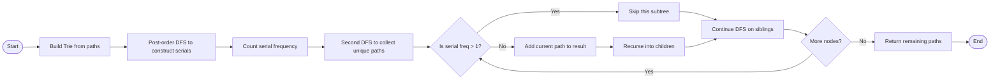
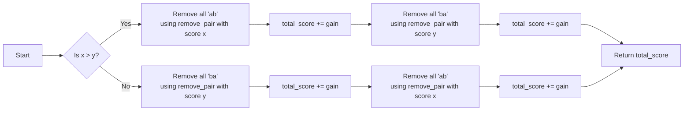

[Delete Duplicate Folders in System - LeetCode](https://leetcode.com/problems/delete-duplicate-folders-in-system/description/?envType=daily-question&envId=2025-07-20)

- This starts from my birthday initiative, is not to late to start workin on these 
- If it is hard, set a 10 minutes timer, and if cannot be solved, jump to solution, create flow chart and continue understanding it.
- Follow the pattern of ## for name, ### draft, solution, pseudocode for autoparsing
	- :t tag1,tag2
	- :d difficulty
	- :l leetcode link, can be multiple
	- modes show python, run in java, show psudocode, run in java, python depending on difficulty
---

## 1948. Delete Duplicate Folders in System
:t array, Hash Table, String, Trie, Hash Function
:d hard

Due to a bug, there are many duplicate folders in a file system. You are given a 2D array `paths`, where `paths[i]` is an array representing an absolute path to the `ith` folder in the file system.

- For example, `["one", "two", "three"]` represents the path `"/one/two/three"`.

Two folders (not necessarily on the same level) are **identical** if they contain the **same non-empty** set of identical subfolders and underlying subfolder structure. The folders **do not** need to be at the root level to be identical. If two or more folders are **identical**, then **mark** the folders as well as all their subfolders.

- For example, folders `"/a"` and `"/b"` in the file structure below are identical. They (as well as their subfolders) should **all** be marked:
    - `/a`
    - `/a/x`
    - `/a/x/y`
    - `/a/z`
    - `/b`
    - `/b/x`
    - `/b/x/y`
    - `/b/z`
- However, if the file structure also included the path `"/b/w"`, then the folders `"/a"` and `"/b"` would not be identical. Note that `"/a/x"` and `"/b/x"` would still be considered identical even with the added folder.

Once all the identical folders and their subfolders have been marked, the file system will **delete** all of them. The file system only runs the deletion once, so any folders that become identical after the initial deletion are not deleted.

Return _the 2D array_ `ans` _containing the paths of the **remaining** folders after deleting all the marked folders. The paths may be returned in **any** order_.

>


```
Input: paths = [["a"],["c"],["d"],["a","b"],["c","b"],["d","a"]]
Output: [["d"],["d","a"]]
Explanation: The file structure is as shown.
Folders "/a" and "/c" (and their subfolders) are marked for deletion because they both contain an empty
folder named "b".
```

> 

```
Input: paths = [["a","b"],["c","d"],["c"],["a"]]
Output: [["c"],["c","d"],["a"],["a","b"]]
Explanation: All folders are unique in the file system.
Note that the returned array can be in a different order as the order does not matter.
```

Constraints:

1 <= paths.length <= 2 * 104
1 <= paths[i].length <= 500
1 <= paths[i][j].length <= 10
1 <= sum(paths[i][j].length) <= 2 * 105
path[i][j] consists of lowercase English letters.
No two paths lead to the same folder.
For any folder not at the root level, its parent folder will also be in the input.

### Theory

My draft is to make it a for loop, and then, where is the same end 

- compare bottom up
- If the same then mark for deletion
- otherwise return the following


The map can look like the followin:
```json

and have a word counter
{
b: 1 (how many times it was ended with such), where had been counted twice, then , delete like a trie?

}


{
	b a
	b c a
	b c x
	c a
}
```

```
dfs 
	for...
		append to curent
		explore each with current path
		remove from current
	

```

### Solution
```python
class Trie:
    # current node structure's serialized representation
    serial: str = ""
    # current node's child nodes
    children: dict

    def __init__(self):
        self.children = dict()


class Solution:
    def deleteDuplicateFolder(self, paths: List[List[str]]) -> List[List[str]]:
        # root node
        root = Trie()

        for path in paths:
            cur = root
            for node in path:
                if node not in cur.children:
                    cur.children[node] = Trie()
                cur = cur.children[node]

        # hash table records the occurrence times of each serialized representation
        freq = Counter()

        # post-order traversal based on depth-first search, calculate the serialized representation of each node structure
        def construct(node: Trie) -> None:
            # if it is a leaf node, then the serialization is represented as an empty string, and no operation is required.
            if not node.children:
                return

            v = list()
            # if it is not a leaf node, the serialization representation of the child node structure needs to be calculated first.
            for folder, child in node.children.items():
                construct(child)
                v.append(folder + "(" + child.serial + ")")

            # to prevent issues with order, sorting is needed
            v.sort()
            node.serial = "".join(v)
            # add to hash table
            freq[node.serial] += 1

        construct(root)

        ans = list()
        # record the path from the root node to the current node.
        path = list()

        def operate(node: Trie) -> None:
            # if the serialization appears more than once in the hash table, it needs to be deleted.
            if freq[node.serial] > 1:
                return
            # otherwise add the path to the answer
            if path:
                ans.append(path[:])

            for folder, child in node.children.items():
                path.append(folder)
                operate(child)
                path.pop()

        operate(root)
        return ans
```

```java
class Solution {

    class Trie {

        String serial; // current node structure's serialized representation
        Map<String, Trie> children = new HashMap<>(); // current node's child nodes
    }

    public List<List<String>> deleteDuplicateFolder(List<List<String>> paths) {
        Trie root = new Trie(); // root node

        // build a trie tree
        for (List<String> path : paths) {
            Trie cur = root;
            for (String node : path) {
                cur.children.putIfAbsent(node, new Trie());
                cur = cur.children.get(node);
            }
        }

        Map<String, Integer> freq = new HashMap<>(); // hash table records the occurrence times of each serialized representation
        // post-order traversal based on depth-first search, calculate the serialized representation of each node structure
        construct(root, freq);
        List<List<String>> ans = new ArrayList<>();
        List<String> path = new ArrayList<>();
        // operate the trie, delete duplicate folders
        operate(root, freq, path, ans);
        return ans;
    }

    private void construct(Trie node, Map<String, Integer> freq) {
        if (node.children.isEmpty()) return; // if it is a leaf node, no operation is needed.

        List<String> v = new ArrayList<>();
        for (Map.Entry<String, Trie> entry : node.children.entrySet()) {
            construct(entry.getValue(), freq);
            v.add(entry.getKey() + "(" + entry.getValue().serial + ")");
        }

        Collections.sort(v);
        StringBuilder sb = new StringBuilder();
        for (String s : v) {
            sb.append(s);
        }
        node.serial = sb.toString();
        freq.put(node.serial, freq.getOrDefault(node.serial, 0) + 1);
    }

    private void operate(
        Trie node,
        Map<String, Integer> freq,
        List<String> path,
        List<List<String>> ans
    ) {
        if (freq.getOrDefault(node.serial, 0) > 1) return; // if the serialization representation appears more than once, it needs to be deleted

        if (!path.isEmpty()) {
            ans.add(new ArrayList<>(path));
        }

        for (Map.Entry<String, Trie> entry : node.children.entrySet()) {
            path.add(entry.getKey());
            operate(entry.getValue(), freq, path, ans);
            path.remove(path.size() - 1);
        }
    }
}
```

### Pseudo Code

```
FUNCTION deleteDuplicateFolder(paths):
    CREATE root Trie node

    // Step 1: Build Trie from input paths
    FOR each path IN paths:
        current = root
        FOR each folder IN path:
            IF folder NOT IN current.children:
                current.children[folder] = new Trie node
            current = current.children[folder]

    // Step 2: Compute serialization of each subtree using post-order DFS
    CREATE hash map freq to store serialization counts

    FUNCTION construct(node):
        IF node has no children:
            RETURN
        INITIALIZE list serials
        FOR each (folder, child) IN node.children:
            construct(child)
            APPEND folder + "(" + child.serial + ")" TO serials
        SORT serials
        node.serial = CONCATENATE all strings in serials
        INCREMENT freq[node.serial] by 1

    CALL construct(root)

    // Step 3: Traverse tree and collect non-duplicate paths
    INITIALIZE result list ans
    INITIALIZE empty list path to store current traversal path

    FUNCTION operate(node):
        IF freq[node.serial] > 1:
            RETURN // skip this duplicate subtree
        IF path is not empty:
            ADD COPY of path TO ans
        FOR each (folder, child) IN node.children:
            ADD folder TO path
            CALL operate(child)
            REMOVE last element FROM path

    CALL operate(root)

    RETURN ans

```



---

## 1717. Maximum Score From Removing Substrings

:l 
:y [1717. Maximum Score From Removing Substrings](https://www.youtube.com/watch?v=ssc88WyNBYQ)
### Theory

- Idea is to have in n loops required until it gathers prioritizing 

![[Pasted image 20250723030756.png]]
Let’s define:
- Let `N_ab` be the number of `"ab"` pairs removed
- Let `N_ba` be the number of `"ba"` pairs removed
- Let `A` be the total number of `a`s in `s`
- Let `B` be the total number of `b`s in `s`
    
Each `"ab"` or `"ba"` removal consumes 1 `a` and 1 `b`, so:
`N_ab + N_ba ≤ min(A, B)`

You can generalize this to any substring replacement problem where:
- Operations consume overlapping resources
- Each operation has a fixed score
- You want to maximize the total score
### Solution

```python
class Solution:
    def maximumGain(self, s: str, x: int, y: int) -> int:
        def remove_pair(s, first, second, score):
            stack = []
            total = 0
            for c in s:
                if stack and stack[-1] == first and c == second:
                    stack.pop()
                    total += score
                else:
                    stack.append(c)
            return "".join(stack), total

        total_score = 0

        if x > y:
            s, gain = remove_pair(s, 'a', 'b', x)
            total_score += gain
            s, gain = remove_pair(s, 'b', 'a', y)
            total_score += gain
        else:
            s, gain = remove_pair(s, 'b', 'a', y)
            total_score += gain
            s, gain = remove_pair(s, 'a', 'b', x)
            total_score += gain

        return total_score
```

```java
class Solution {
    public int maximumGain(String s, int x, int y) {
        if (x > y) {
            // Remove "ab" first
            String[] result1 = removePair(s, 'a', 'b', x);
            String[] result2 = removePair(result1[0], 'b', 'a', y);
            return Integer.parseInt(result1[1]) + Integer.parseInt(result2[1]);
        } else {
            // Remove "ba" first
            String[] result1 = removePair(s, 'b', 'a', y);
            String[] result2 = removePair(result1[0], 'a', 'b', x);
            return Integer.parseInt(result1[1]) + Integer.parseInt(result2[1]);
        }
    }

    private String[] removePair(String s, char first, char second, int score) {
        StringBuilder stack = new StringBuilder();
        int total = 0;

        for (char c : s.toCharArray()) {
            int len = stack.length();
            if (len > 0 && stack.charAt(len - 1) == first && c == second) {
                stack.deleteCharAt(len - 1);
                total += score;
            } else {
                stack.append(c);
            }
        }

        return new String[]{stack.toString(), String.valueOf(total)};
    }
}

```

### Pseudocode





## 3480. Maximize Subarrays After Removing One Conflicting Pair

:d hard
:l https://leetcode.com/problems/maximize-subarrays-after-removing-one-conflicting-pair
:t Array, Segment Tree, Enumeration, Prefix Sum

You are given an integer n which represents an array nums containing the numbers from 1 to n in order. Additionally, you are given a 2D array conflictingPairs, where conflictingPairs[i] = [a, b] indicates that a and b form a conflicting pair.

Remove exactly one element from conflictingPairs. Afterward, count the number of non-empty subarrays of nums which do not contain both a and b for any remaining conflicting pair [a, b].

Return the maximum number of subarrays possible after removing exactly one conflicting pair.
### Theory


### Solution

```cpp
class Solution {
public:
    long long maxSubarrays(int n, vector<vector<int>>& conflictingPairs) {
        vector<int> bMin1(n + 1, n + 1), bMin2(n + 1, n + 1);
        for (const auto& pair : conflictingPairs) {
            int a = min(pair[0], pair[1]), b = max(pair[0], pair[1]);
            if (bMin1[a] > b) {
                bMin2[a] = bMin1[a];
                bMin1[a] = b;
            } else if (bMin2[a] > b) {
                bMin2[a] = b;
            }
        }
        long long res = 0;
        int b1 = n + 1, b2 = n + 1;
        vector<long long> delCount(n + 2, 0);
        for (int i = n; i >= 1; i--) {
            if (b1 > bMin1[i]) {
                b2 = min(b1, bMin2[i]);
                b1 = bMin1[i];
            } else {
                b2 = min(b2, bMin1[i]);
            }
            res += b1 - i;
            delCount[b1] += b2 - b1;
        }
        return res + *max_element(delCount.begin(), delCount.end());
    }
};
```


## 2210. Count Hills and Valleys in an Array

:d easy
:l https://leetcode.com/problems/count-hills-and-valleys-in-an-array
:t array

You are given a 0-indexed integer array nums. An index i is part of a hill in nums if the closest non-equal neighbors of i are smaller than nums[i]. Similarly, an index i is part of a valley in nums if the closest non-equal neighbors of i are larger than nums[i]. Adjacent indices i and j are part of the same hill or valley if nums[i] == nums[j].

Note that for an index to be part of a hill or valley, it must have a non-equal neighbor on both the left and right of the index.

Return the number of hills and valleys in nums.
### Theory

We treat flat regions (consecutive equal numbers) as not influencing the valley/hill status. Only the last different values before and after the current index matter. So for each index $i$ :
- Let $a=$ last left unequal to nums $[i]$
- Let $b=$ nums $[i]$
- Let $c=$ first right unequal to nums $[i]$

Then:
- Hill: $a\langle b\rangle c$
- Valley: $a>b<c$

Since we only need to evaluate this once per unique peak/trough, the entire approach is linear.

This greedy linear approach works when:
- Only relative comparison (greater than, less than) determines the pattern.
- Duplicate adjacent values can be collapsed to the last significant direction change.
- You only need to check three relevant values: left, current, right.

Similar to problems like:
- Monotonic trend detection
- Zig-zag subsequence detection
- Local extrema counting in time series


### Solution


Optimized

```java
class Solution {
    public int countHillValley(int[] nums) {
        int res = 0;
        int n = nums.length;

        // Keep track of the last non-equal element on the left
        int prev = nums[0];

        for (int i = 1; i < n - 1; i++) {
            if (nums[i] == nums[i + 1]) continue;

            if ((prev < nums[i] && nums[i] > nums[i + 1]) ||
                (prev > nums[i] && nums[i] < nums[i + 1])) {
                res++;
            }
            prev = nums[i];
        }

        return res;
    }
}

```

```java
class Solution {
    public int countHillValley(int[] nums) {
        int res = 0; // number of peaks and valleys
        int n = nums.length;
        for (int i = 1; i < n - 1; ++i) {
            if (nums[i] == nums[i - 1]) {
                // deduplication
                continue;
            }
            int left = 0; // left side possibly unequal neighboring corresponding state
            for (int j = i - 1; j >= 0; --j) {
                if (nums[j] > nums[i]) {
                    left = 1;
                    break;
                } else if (nums[j] < nums[i]) {
                    left = -1;
                    break;
                }
            }
            int right = 0; // right side possibly unequal neighboring corresponding state
            for (int j = i + 1; j < n; ++j) {
                if (nums[j] > nums[i]) {
                    right = 1;
                    break;
                } else if (nums[j] < nums[i]) {
                    right = -1;
                    break;
                }
            }
            if (left == right && left != 0) {
                // at this time, index i is part of a peak or valley.
                ++res;
            }
        }
        return res;
    }
}
```
```cpp
class Solution {
public:
    int countHillValley(vector<int>& nums) {
        int res = 0;  // number of peaks and valleys
        int n = nums.size();
        for (int i = 1; i < n - 1; ++i) {
            if (nums[i] == nums[i - 1]) {
                // deduplication
                continue;
            }
            int left = 0;  // left side possibly unequal neighboring
                           // corresponding state
            for (int j = i - 1; j >= 0; --j) {
                if (nums[j] > nums[i]) {
                    left = 1;
                    break;
                } else if (nums[j] < nums[i]) {
                    left = -1;
                    break;
                }
            }
            int right = 0;  // right side possibly unequal neighboring
                            // corresponding state
            for (int j = i + 1; j < n; ++j) {
                if (nums[j] > nums[i]) {
                    right = 1;
                    break;
                } else if (nums[j] < nums[i]) {
                    right = -1;
                    break;
                }
            }
            if (left == right && left != 0) {
                // at this time, index i is part of a peak or valley.
                ++res;
            }
        }
        return res;
    }
};
```


## 2044. Count Number of Maximum Bitwise-OR Subsets

:d medium
:l https://leetcode.com/problems/count-number-of-maximum-bitwise-or-subsets
:t Array, Backtracking, Bit Manipulation. Enumeration

Given an integer array nums, find the maximum possible bitwise $\mathbf{O R}$ of a subset of nums and return the number of different non-empty subsets with the maximum bitwise $O R$.

An array $a$ is a subset of an array $b$ if $a$ can be obtained from $b$ by deleting some (possibly zero) elements of b . Two subsets are considered different if the indices of the elements chosen are different.

The bitwise $O R$ of an array $a$ is equal to $a[0] O R a[1] O R \ldots O R a[a$. length -1$]$ ( $\mathbf{0}$-indexed).

```
Example 1:

Input: nums = [3,1]
Output: 2
Explanation: The maximum possible bitwise OR of a subset is 3. There are 2 subsets with a bitwise OR of 3:
- [3]
- [3,1]
Example 2:

Input: nums = [2,2,2]
Output: 7
Explanation: All non-empty subsets of [2,2,2] have a bitwise OR of 2. There are 23 - 1 = 7 total subsets.
Example 3:

Input: nums = [3,2,1,5]
Output: 6
Explanation: The maximum possible bitwise OR of a subset is 7. There are 6 subsets with a bitwise OR of 7:
- [3,5]
- [3,1,5]
- [3,2,5]
- [3,2,1,5]
- [2,5]
- [2,1,5]
```

### Theory


### Solution

```java
class Solution {

    public int countMaxOrSubsets(int[] nums) {
        int maxOrValue = 0;
        for (int num : nums) {
            maxOrValue |= num;
        }
        return countSubsets(nums, 0, 0, maxOrValue);
    }

    private int countSubsets(
        int[] nums,
        int index,
        int currentOr,
        int targetOr
    ) {
        // Base case: reached the end of the array
        if (index == nums.length) {
            return (currentOr == targetOr) ? 1 : 0;
        }

        // Don't include the current number
        int countWithout = countSubsets(nums, index + 1, currentOr, targetOr);

        // Include the current number
        int countWith = countSubsets(
            nums,
            index + 1,
            currentOr | nums[index],
            targetOr
        );

        // Return the sum of both cases
        return countWithout + countWith;
    }
}
```


